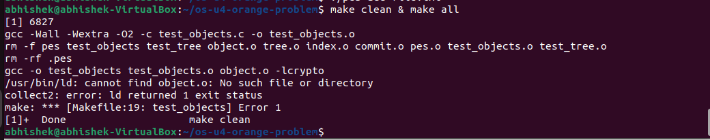
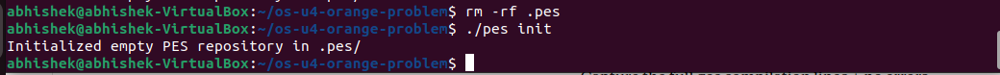
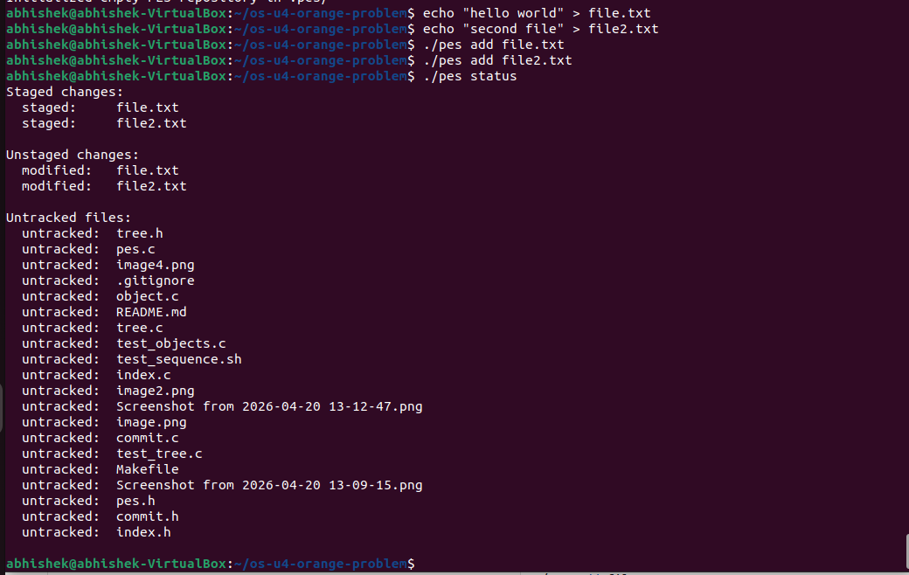
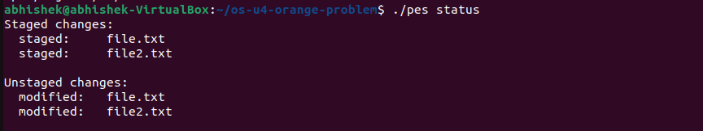
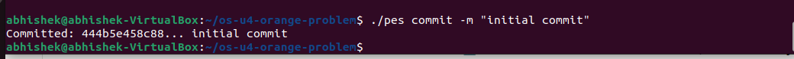
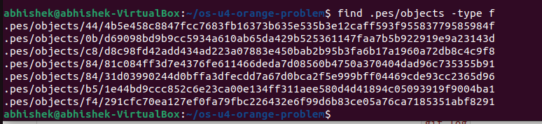
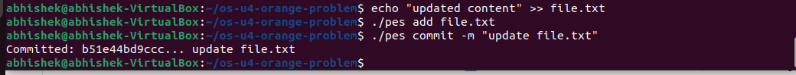
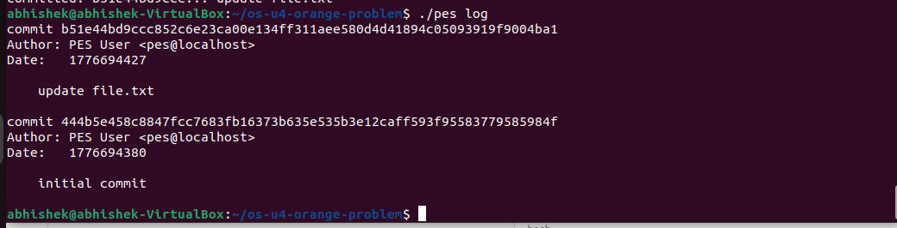

---

## 📝 1. Project Title

```markdown
# PES Version Control System (PES-VCS)
```

---

## 📌 2. Description

```markdown
A simplified Git-like Version Control System implemented in C.

This project supports:
- Object storage (blobs, trees, commits)
- Staging area (index)
- Basic commands like init, add, commit, status, and log
```

---

## ⚙️ 3. Features

```markdown
## Features

- Initialize repository (`pes init`)
- Stage files (`pes add <file>`)
- View status (`pes status`)
- Create commits (`pes commit -m "message"`)
- View commit history (`pes log`)
- Object storage using SHA-256 hashing
```

---

## 🛠️ 4. How to Build

````markdown
## Build Instructions

```bash
make clean
make all
````

````

---

## ▶️ 5. How to Run
```markdown
## Usage

### Initialize repository
```bash
./pes init
````

### Add file

```bash
./pes add file.txt
```

### Check status

```bash
./pes status
```

### Commit

```bash
./pes commit -m "first commit"
```

### View log

```bash
./pes log
```

````

---

## 🧪 6. Testing
```markdown
## Testing

Run test cases:

```bash
./test_objects
./test_tree
./test_sequence.sh
````

````

---

---

## 📸 7. Screenshots (VERY IMPORTANT for marks)

### Build Output


### Repository Initialization


### Adding Files


### Status Output



### Object Storage


### Commit Output


### Log Output



---
```
images/
```

---

## 📂 8. Project Structure

```markdown
## Project Structure

- object.c / object.h → Object storage
- tree.c / tree.h → Tree structure
- index.c / index.h → Staging area
- commit.c / commit.h → Commit handling
- pes.c → CLI interface
```

---

## ⚠️ 9. Known Issues (optional but good)

```markdown
## Known Issues

- Limited support for nested directories
- Basic error handling
```

---

## 👨‍💻 10. Author

```markdown
## Author

Abhishek H Kinagi  
PES University
```

---
